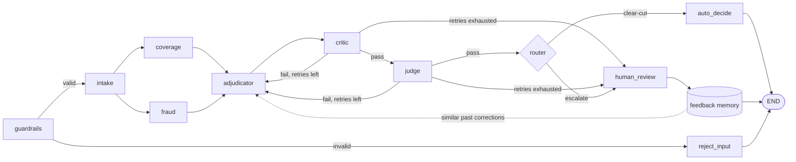

# autoclaim-adjudicator

[](https://github.com/SaiCharan85/autoclaim-adjudicator/actions/workflows/ci.yml)

A claims-adjudication harness for **auto physical-damage insurance** (collision and comprehensive).
It decides clear-cut claims on its own, catches fraud and coverage violations, and sends only the
genuinely ambiguous cases to a human adjuster with a ready-made case summary. Adjuster decisions
feed a memory it can learn from.

It is a **deterministic multi-agent workflow**, not an autonomous agent: **code decides control flow
and facts, LLMs decide judgment and language, and independent checks verify.** Every model it uses
is free (Groq and Google AI Studio free tiers, local models on Ollama), and every number in a
decision comes from code, never from an LLM.

## One claim, step by step

> *"I hit a deer on the highway last night"* ->
> **intake** extracts the facts (cause: animal) ->
> **code** derives the coverage part (animal strike = comprehensive in the US), checks the policy
> has comprehensive, looks up the $250 comprehensive deductible and computes $1,900 - $250 = $1,650 ->
> **coverage** retrieves the relevant policy clauses (hybrid search + policy graph) ->
> **fraud** scores the claim (CatBoost + anomaly detector + red-flag rules) ->
> **adjudicator** (LLM) writes the decision and explanation; code overwrites any amount it states ->
> **critic** (code) checks the cited clauses exist and nothing contradicts the facts ->
> **judge** (a different LLM family) grades the *reasoning*, never the outcome ->
> **router** (code) auto-approves $1,650, or escalates (low confidence, high fraud score, over the
> authority limit, a trap rule) to a human, who answers in the console.

## Architecture



A shared **core** (graph, routing, retries, audit log, budgets, fail-safe, idempotent finalization,
human review, feedback memory) runs a pluggable **line of business**. The auto line is the main one;
a **flood line on real FEMA claims** plugs into the same core with no core changes. Details:
[docs/architecture.md](docs/architecture.md).

## Results so far

| What | Data | Result |
|---|---|---|
| Two-stage fraud triage (first notice + independent appraisal) | locked test, simulated US claims | **78.3%** of true fraud intercepted at a 10.0% review rate (ROC-AUC 0.860 / 0.955) |
| Two-stage triage inside the harness | validation, claims with an appraisal | **79.5%** of true fraud referred at a 9.5% review rate (first notice alone: 61.3%) ([validation](docs/fraud_two_stage_harness.md)) |
| Fraud scoring: ML vs LLM-only vs hybrid | locked test, 200 claims | ROC-AUC **0.855** vs 0.631 vs 0.853: the ML score is kept, the LLM only explains |
| Harness, full arm (pilot) | 50 validation-period claims | 50% decided alone, **100%** of those correct; 0 wrong approvals, trap leaks or paid frauds; 5.5 LLM calls per claim |
| **Harness, locked test** | 300 test-period claims (H2 2024), run once | **55.3%** decided alone, **97.6%** of those correct (162 of 166); 4 wrong approvals: 3 of 20 true frauds paid and 1 hit-and-run trap ($15.6k paid in error, $53 per claim); 0 fail-safes; 4.4 LLM calls per claim ([report](eval/report_eval.md)) |
| Ablations: no judge, no critic, few-shot memory (pilot) | same 50 claims, paired | no quality difference detectable at n=50 (all paired CIs include 0; every arm 100% auto-decision accuracy); the judge costs +2.5 and the critic +1.0 calls per claim ([report](eval/report_dev.md)) |
| Judge, planted-error test (pilot) | 54 dev cases | 87.5% of planted errors caught; 2 of 10 clean cases flagged |
| Fine-tuned local judge / intake / adjudicator (Qwen3-4B QLoRA) | held-out synthetic examples | judge catch rate 30% -> **95%**, false alarms 18% -> 6%; intake fields 58% -> **95%**; adjudicator outcome 85% -> **99%**, wrong approvals 22.5% -> **0%** |
| Flood line plug-in | locked test, real FEMA NFIP claims | **98.6%** agreement with FEMA's outcomes; 0.3% wrongly denied, 0.3% wrongly paid |
| Fraud model drift across eras | real crashes 2002-2023 (GES + CRSS), simulated fraud | trained on 2002-2009, tested 11 years later: ROC-AUC 0.861 -> 0.859, no meaningful decay ([drift study](docs/drift_study.md)) |
| Policy retrieval | 60 labeled queries | hybrid + 1-hop graph: context recall 0.889 vs 0.531 for keyword search alone |

Every locked-test use is logged in [docs/test_set_log.md](docs/test_set_log.md). Read the
[limitations](docs/limitations.md) before reading anything into these numbers: most claims are
simulated, and the judge and fine-tuning results come from synthetic test cases.

## Quick start

```bash
uv sync && uv run pre-commit install
cp .env.example .env                                    # free keys: Groq, Google AI Studio (optional: LangSmith, Kaggle)
uv run python scripts/download_data.py                  # NHTSA crash data (+ FEMA flood claims: `fema_nfip`)
uv run python scripts/simulate_claims.py                # simulated claims grounded in real crashes (~1 s)
uv run pytest                                           # no network, no keys needed
```

## Demo

```bash
uv run python scripts/download_data.py nhtsa_complaints  # 500+ real crash stories (public domain, ~1 min)
uv run streamlit run src/autoclaim/ui/console.py         # opens http://127.0.0.1:8501 (this machine only)
```

**Try a claim** (sidebar page): pick a real crash story from NHTSA's public complaint database,
written by vehicle owners, or write your own; adjust the policy, car and repair estimate; and run it
through the full harness. The page shows the verdict (approved and how much, denied, or sent to an
adjuster), a step-by-step trace (story read, driver checked, coverage matched, fraud screened,
payout worked out, decision double-checked, routed), the letter to the policyholder and the audit
trail. The story is used word for word; the form holds what an insurer already knows. Each run is
about 4-6 free-tier LLM calls, cached, so the same story and form never run twice.

**Adjuster console** (main page): claims the harness sent to a person.

Demo damage photos (optional, free Unsplash key in `.env`): `uv run python scripts/fetch_demo_images.py`.
Every icon, illustration, animation and photo, and where it comes from: [ASSETS.md](ASSETS.md).

The console lists claims the harness could not decide alone, with why each was escalated, the
proposed decision (outcome, payout, cited clauses, explanation), the deterministic numbers, fraud
signals and any critic or judge issues. Submitting a decision resumes the paused claim (finalized
exactly once) and stores it in feedback memory. The console makes no LLM calls.

## Documentation

| Doc | What's in it |
|---|---|
| [architecture.md](docs/architecture.md) | Nodes, the core / line-of-business seam, cross-cutting guarantees |
| [playbook.md](docs/playbook.md) | How to run it day to day on free quotas, resume, review, retrain, add a line |
| [limitations.md](docs/limitations.md) | What the results do and do not show |
| [evaluation_protocol.md](docs/evaluation_protocol.md) | Leakage and overfitting rules, and which are enforced by tests |
| [harness.md](docs/harness.md) | The harness in detail, free-tier throughput |
| [model_card.md](docs/model_card.md) | The fraud models |
| [simulator.md](docs/simulator.md) | How simulated claims are grounded in real crash data |
| [finetune.md](docs/finetune.md), [flood.md](docs/flood.md) | Fine-tuning; the flood plug-in |

The judge is built on [JudgeKit](https://github.com/SaiCharan85/JudgeKit), a domain-agnostic
LLM-as-judge library (rubrics, panels, planted-error evals, calibration, bias tests).

## Data

See [DATA.md](DATA.md). No data, model weights or indexes are committed. This product uses the
Federal Emergency Management Agency's OpenFEMA API, but is not endorsed by FEMA. The Federal
Government or FEMA cannot vouch for the data or analyses derived from these data after the data
have been retrieved from the Agency's website(s).

## License

MIT. See [LICENSE](LICENSE).
